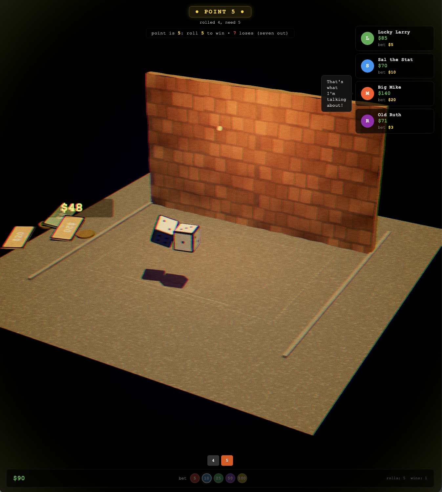

# crapser

A browser-based street craps game built with Three.js and Cannon-es. You're the shooter — aim, throw, and ride the pass line against four NPCs, all in a grimy 3D alley.



## how it works

- **Aim** by dragging on the table — a dashed line and target ring show where the dice will go
- **Throw** with left click or spacebar for a straight shot down the middle
- **Power** scales with aim distance (the bar fills up)
- **Bet** using the chip buttons ($5 / $10 / $25 / $50 / $100) or cycle with arrow keys
- **Craps rules**: 7/11 wins on come-out, 2/3/12 loses. Hit your point to win, seven-out to lose

Everything happens in one hand — no waiting for turns. You shoot until you seven-out, then the next round starts.

## the gimmicks

- **4 NPCs** (Larry, Sal, Mike, Ruth) each with their own personality, betting style, and one-liners
- **Dice combos** get called out by the announcer in proper craps slang — "Snake Eyes", "Little Joe from Kokomo", etc.
- **Procedural audio** — all sounds are generated on the fly, no audio files
- **Retro film grain + vignette** to make it feel like a 70s crime movie
- **Physical money pile** that builds up at the side of the table
- **Dice physics** — they tumble, bounce off the back wall, and need to hit the wall to count

## running it locally

```bash
npm install
npm run dev
```

Build for production:

```bash
npm run build
```

## tech

- [Three.js](https://threejs.org/) for 3D
- [Cannon-es](https://github.com/pmndrs/cannon-es) for physics
- [Vite](https://vitejs.dev/) for dev/build
- Web Audio API for sound
- Zero frameworks — all DOM UI is manual
